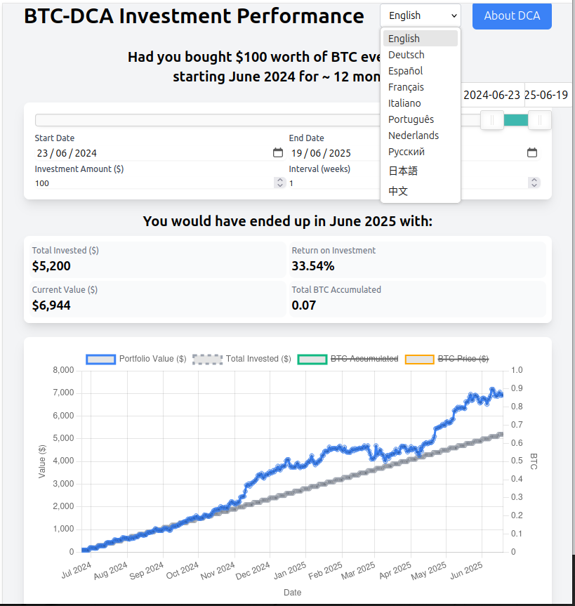

# BTC Dollar-Cost Averaging (DCA) Calculator



*A sample simulation showing DCA results and performance chart for Bitcoin, with multilingual support.*

A web application to visualize the results of a Bitcoin dollar-cost averaging (DCA) investment strategy using real historical price data. The app allows you to simulate what would have happened if you had regularly invested a fixed amount in Bitcoin over any period in the past.

This project is designed for full transparency and ease of use. All historical price data is embedded directly within a JavaScript file, allowing you to run the calculator by simply opening `index.html` in your browser. No web server or internet connection is required to perform calculations.

## Getting Started

### Prerequisites
- **Node.js** (only required for data conversion, not for running the app)
- A modern web browser

### Initial Setup

1. **Download Historical Data:**
   - Go to [Investing.com Bitcoin Historical Data](https://www.investing.com/crypto/bitcoin/historical-data)
   - Select a date range starting from **11/11/2011** (earliest available data)
   - Click "Download" to get the CSV file
   - Save it as `Bitcoin Historical Data.csv` in the `BTC-Price/` folder

2. **Convert Data to JavaScript:**
   ```bash
   cd BTC-Price
   node convertToJs.js
   ```
   This creates `btc-price-data.js` in the main directory with a backup of any existing file.

3. **Run the Application:**
   - Open `index.html` in any web browser
   - No server required - it works completely offline!

### Updating Price Data

To keep your price data current:

1. **Check your latest date:** Look at the most recent date in your existing `Bitcoin Historical Data.csv` file
2. **Download new data:** Go to Investing.com and download data starting from **one day after** your latest date
3. **Merge the files:** Copy the new data rows from the downloaded file and paste them into your existing `Bitcoin Historical Data.csv` file
4. **Convert again:** Run `node convertToJs.js` to update the JavaScript file

This approach ensures you maintain a complete historical dataset while adding only the new data.

## Features

- **Run Anywhere:** Works "out-of-the-box" by opening `index.html` locally. No web server needed.
- **Multilingual Support:** Instantly switch between 10 languages (English, German, Spanish, French, Italian, Portuguese, Dutch, Russian, Japanese, Chinese) using the language selector in the main interface.
- **Consistent USD Display:** All results and charts use the $ (USD) currency symbol for clarity, regardless of selected language.
- **Interactive DCA Simulation:**
  - Drag-and-drop date range slider for easy period selection.
  - Set investment amount and interval (in weeks).
  - Real-time calculation updates as you adjust inputs.
- **Embedded Historical Data:**
  - All price data is stored in `btc-price-data.js`, ensuring the app works offline and calculations are transparent.
- **Modern UI:**
  - Clean, responsive grid layout for inputs and results.
  - Large, interactive performance chart with BTC price overlay.
- **Results Display:**
  - Total invested, ROI, current value, and total BTC accumulated.
  - Dynamic summary showing investment period and frequency.
- **About Modal:**
  - Clickable "About DCA" popup with a plain-language explanation, fully translated in all supported languages.

## How It Works: Data Flow

The data pipeline is designed to be manual and transparent, giving you full control over the data used in the calculations.

**1. Download Historical Data from Investing.com**

First, you manually download the historical daily price data for Bitcoin from Investing.com.


- Go to the [Investing.com Bitcoin Historical Data page](https://www.investing.com/crypto/bitcoin/historical-data).
- Select your desired date range.
- Click the "Download" button to get the CSV file.

**2. Convert the CSV to a JavaScript File**

The downloaded CSV needs to be converted into a JavaScript array. This is done using the provided Node.js script.

- Place the downloaded CSV file in the `BTC-Price/` directory.
- Run the `convertToJs.js` script with Node.js to process the CSV.
- The script will automatically generate the `btc-price-data.js` file, which contains the entire price history as a JavaScript object.

This workflow ensures that you can verify the data source and run the application in a completely self-contained environment.

## How to Use

1.  Clone or download the project from GitHub.
2.  Open the `index.html` file in any modern web browser.
3.  Use the slider or date inputs to select your investment period.
4.  Enter your desired investment amount and interval.
5.  The results and chart will update automatically.
6.  Use the language selector at the top to instantly switch between 10 languages.

## Technologies Used

- HTML5, CSS3 (Tailwind CSS)
- JavaScript (ES6+)
- Chart.js (for data visualization)
- Node.js (for data conversion script)

## License

This project is open source and available under the MIT License. 